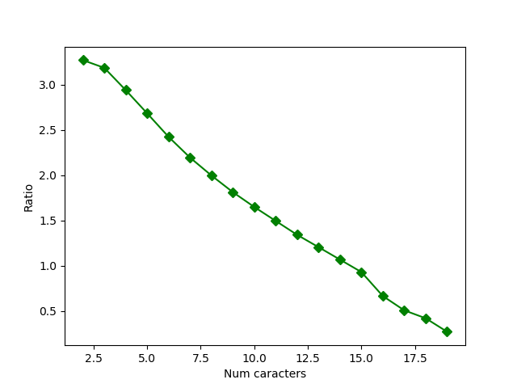
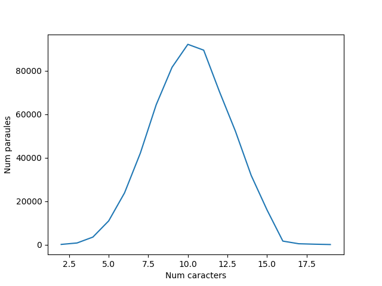
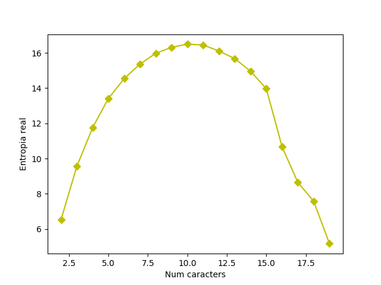

# SPD - Exercici 4: Teoria la informació

**Autor:** Francesc Xavier Bullich Parra

## Opció B - Càlcul de la ratio real de paraules en català

[Veure fitxer ratio.py](https://github.com/fxbp/spd_ex4/blob/master/ratio.py)

Es disposa d'un fitxer diccionari amb paraules en català. Aquestes paraules contenen totes les lletres de l'alfabet català, incloent la ç per no la w ni la k.

Podem calcular la ratio absoluta del llenguatge R = log2(25) i ens donaria els bits per caracter que es necessitaria per codificar caracters en català. Aquesta formula però te en compte que tots els caràcters tenen una probaibilitat equiprobable. Sabem però que en qualsevol llenguatge aixó no és cert. Algunes lletres surten molt mes que d'altres i el fet de trobar un caracter X despres de un Y son fets totalement depenents. Per tant existeix un altre valor r que te en compte aquestes probatilitats diferents. És a dir que podem trobar un nombre menor de bits per caracter per codificar el català.

El que es fara és calcular la r per a cada conjunt de paraules d'un determinat nombre de caràcters.

Per fer-ho s'utilitza la formula:

```
Nombre de paraules de N caracters = 2^(r*N)
```

Si s'apliquen logaritmes en base 2 als 2 costats i s'ailla la r ens trobem el següent:

```
r = (log2(Nombre de paraules de N caracters))/N
```

Mostro algun exemple que demana un N com a input i mostra la r resultant.

```
python ratio.py
Entreu un nombre de caracters n per calular-ne la ratio: 6
Hi ha un total de 23809 paraules de 6 caracters
La ratio absoluta: 4.643856189774724
La ratio real per 6 caracters: 2.4232032344842294
Entropia per 6 caracters: 14.539219406905376
```

## Analisis del valor de r

Un cop vist com es calcula la r segons el nombre de caràcters podem calcular-la per tots els valors possibles de nombre de caracters. En el fitxer el valor maxim es de 19 caracters, per tant fent un bucle de 0 a 19, buscant els valors valids, podem veure com es comporta la r i també la entropia.



En aquest gràfic es pot veure el comportament de la r o ratio verdadera. Com s'ha comentat es log2(n)/N. Es important fixarse que per a cada N es divideix la entropia per N per tant a major nombre de caràcters menor ha de ser la ratio.


Distribució de paraules:



Si ens fixem en un nombre gran de N es pot veure que hi ha menys aparicions de paraules. Aixó passa també amb un nombre petit per N. Aixó també ens serveix per veure perque la ratio és més baixa en un nombre alt de N.

El nombre de paraules de un N alt es baix, per tant és més senzill "endevinar la paraula" si sen sap un tros.
Dit d'una altre forma, la incertesa serà menor en paraules amb una N gran.

El mateix passa amb les N petites, peró pel fet de que son N petites la ratio ens surt més gran.

Veiem el gràfic per la entropia:



Aquí és pot comprovar facilment el que s'explicava. Per a N petites, la entropia és petita i per a N grans la entropia també es petita.

En canvi per a N mitjanes (sobre el 10) tenim una variabilitat major (existeixen més combinacions possibles), per tant la incertesa de cada caracter és major. Per tant la entropia en paraules amb aquestes N sera major.

D'altra banda, si tornem a la ratio, podem veure que encara que tenim un valor d'entropia molt major per a N=10, la ratio es menor que N=2 justament perque dividim la entropia per N.
